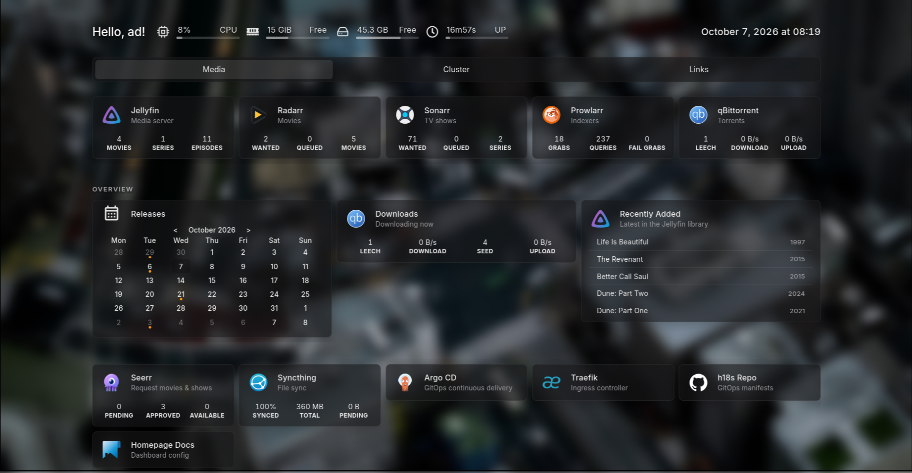
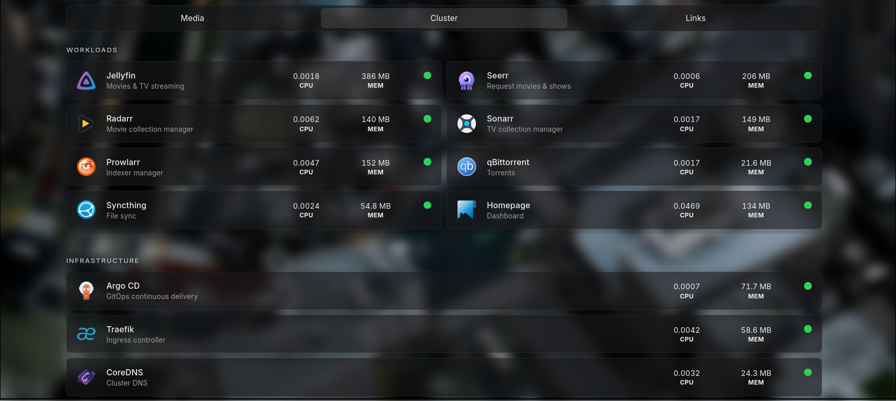
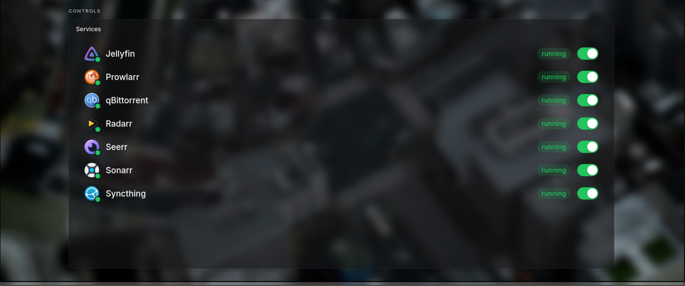
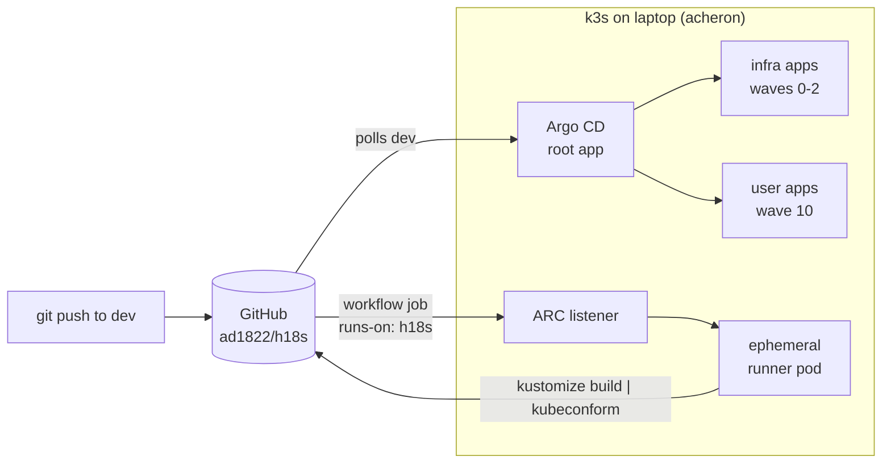

# h18s

## Screenshots

<p align="center">
  <a href="assets/homepage.png">
    
  </a>
  <br>
  <sub><b>Homepage, Media tab:</b> live widgets for Jellyfin, the *arr apps, qBittorrent, Seerr and Syncthing</sub>
</p>

<table>
  <tr>
    <td width="50%" align="center">
      <a href="assets/cluster-info.png">
        
      </a>
      <br>
      <sub><b>Cluster tab:</b> CPU and memory per workload, found through Kubernetes service discovery</sub>
    </td>
    <td width="50%" align="center">
      <a href="assets/toggler.png">
        
      </a>
      <br>
      <sub><b>Toggler:</b> on-demand apps scaled between 0 and 1 replica, embedded in Homepage</sub>
    </td>
  </tr>
</table>

A single-node Kubernetes homelab on my laptop, managed with GitOps.
Everything in the cluster is defined in this repo. Argo CD watches the `dev`
branch and applies it, and CI checks every change before it lands.

| | |
|---|---|
| **Cluster** | k3s `v1.36` on one node (`acheron`, 16 cores / 24 GB) |
| **GitOps** | Argo CD `v3.5`, app-of-apps, tracking `dev` |
| **Ingress** | Traefik (bundled with k3s), TLS from a private root CA |
| **Secrets** | Bitnami Sealed Secrets, encrypted secrets committed to git |
| **CI** | GitHub Actions on self-hosted runners in the cluster (ARC) |
| **Domain** | `*.h18s.lab`, resolved locally via `/etc/hosts` |

---

## Architecture

### GitOps flow



- **CD is pull-based.** Argo CD polls GitHub and applies what's in `dev`.
  Nothing outside the cluster can deploy to it.
- **CI doesn't touch the cluster.** Runner pods only validate manifests and
  report back to GitHub. They get no Kubernetes permissions.
- The ARC listener makes an **outgoing** connection to GitHub, so no ports
  need to be open on the home network.

### Request flow

```
browser ──► radarr.h18s.lab
            │  /etc/hosts → 127.0.0.1
            ▼
        Traefik (k3s servicelb, :80/:443)
            │  TLS: default cert h18s-tls (TLSStore), signed by h18s root CA
            │  Ingress host rule
            ▼
        Service radarr:7878 ──► Pod radarr
                                 │ hostPath
                                 ▼
                     /home/ad/homelab/{config,data}
```

### Argo CD layout (app-of-apps)

`bootstrap/root.yaml` is the only manifest applied by hand. It points at
`argocd/`, which holds the AppProjects and one `Application` per app.

| Sync wave | Applications | Project | Namespace |
|---|---|---|---|
| -1 | AppProjects `infra`, `apps` | - | `argocd` |
| 0 | `sealed-secrets` | infra | `kube-system` |
| 1 | `traefik-config`, `argocd-config`, `arc-controller` | infra | `kube-system`, `argocd`, `arc-systems` |
| 2 | `arc-runners` | infra | `arc-runners` |
| 10 | `homepage`, `toggler`, `jellyfin`, `prowlarr`, `qbittorrent`, `radarr`, `sonarr`, `seerr`, `syncthing`, `backup` | apps | `default` |

- **`infra` project:** any namespace and any cluster-scoped resource. Sources
  are this repo plus the ARC Helm charts on `oci://ghcr.io`.
- **`apps` project:** only the `default` namespace and this repo. The only
  cluster-scoped resources allowed are ClusterRole and ClusterRoleBinding,
  which Homepage needs for service discovery.

All apps use automated sync with `prune` and `selfHeal`, so manual
`kubectl` changes get reverted. The toggled apps ignore `/spec/replicas`, so
the toggler can scale them without Argo CD undoing it.

---

## Apps

| App | URL | What it does | Image | Always on |
|---|---|---|---|---|
| Homepage | `https://h18s` | Dashboard, with the toggler embedded | `ghcr.io/gethomepage/homepage` | yes |
| Toggler | `https://toggle.h18s.lab` | On/off switches for on-demand apps (my own, see below) | `ayushdumasia/h18s-toggler:0.1.1` | yes |
| Jellyfin | `https://jellyfin.h18s.lab` | Media server | `jellyfin/jellyfin` | toggled |
| Seerr | `https://seerr.h18s.lab` | Movie and show requests, which it passes on to Radarr/Sonarr | `ghcr.io/seerr-team/seerr` | toggled |
| Radarr | `https://radarr.h18s.lab` | Movie automation | `lscr.io/linuxserver/radarr` | toggled |
| Sonarr | `https://sonarr.h18s.lab` | TV automation | `lscr.io/linuxserver/sonarr` | toggled |
| Prowlarr | `https://prowlarr.h18s.lab` | Indexer manager, synced to the *arr apps | `lscr.io/linuxserver/prowlarr` | toggled |
| qBittorrent | `https://qbittorrent.h18s.lab` | Download client | `lscr.io/linuxserver/qbittorrent` | toggled |
| Syncthing | `https://syncthing.h18s.lab` | File sync with my other devices (`hostNetwork`) | `syncthing/syncthing` | toggled |
| Backup | - | Daily rclone sync to Google Drive (CronJob) | `rclone/rclone` | scheduled |

Infrastructure UIs:

| UI | URL |
|---|---|
| Argo CD | `https://argocd.h18s.lab` |
| Traefik dashboard | `https://traefik.h18s.lab/dashboard/` |

### Media flow

```
Seerr (request) ──► Radarr / Sonarr ──► Prowlarr (search indexers)
                          │
                          ▼
                    qBittorrent ──► /data/torrents/{movies,tv}
                          │
                          ▼  hardlink on import (same /data mount, no copy)
                    /data/media/{movies,tv} ──► Jellyfin
```

Services talk to each other by short name (`http://radarr:7878`,
`qbittorrent:8080`), since everything runs in the `default` namespace.

### Toggler (on-demand apps)

The cluster runs on my daily laptop, so most apps stay at 0 replicas until I
need them. `toggler/` is a small Go service with an embedded web page. It
scales an allowlist of Deployments between 0 and 1 replica.

- Allowlist: the `APPS` env var in `apps/toggler/deployment.yaml`.
- Permissions: a namespaced Role that can only `get` and patch
  `deployments/scale` on the names it lists (`apps/toggler/rbac.yaml`). Keep
  both lists in sync.
- API: `GET /api/apps`, `POST /api/apps/{name}/{action}`, `GET /healthz`.
- Embedded in Homepage through its iframe widget. The iframe height lives in
  Homepage's `custom.css` (about 3rem per app).
- Image: built from `toggler/Dockerfile` (distroless, non-root, read-only
  root filesystem).

Turning an app on doesn't turn on what it depends on. For example, Radarr
needs Prowlarr and qBittorrent running to search and download.

---

## Storage

All persistent data uses `hostPath` volumes under my home directory, so it's
plain files on the laptop's disk.

```
/home/ad/homelab/
├── config/<app>/        # each app's config and database, mounted at /config
└── data/                # shared by qBittorrent, Radarr, Sonarr; mounted at /data
    ├── torrents/
    │   ├── incomplete/
    │   ├── movies/
    │   └── tv/
    └── media/           # Jellyfin reads from here
        ├── movies/
        └── tv/
```

- Download clients and *arr apps mount **the same** `data/` root, so imports
  are instant hardlinks, not copies.
- The linuxserver images run as `PUID=1000` / `PGID=1000` with `UMASK=002`,
  so files stay owned by my user.
- `hostPath` volumes use `type: Directory`, so a missing folder fails the pod
  instead of being created silently as root.

---

## Networking, DNS and TLS

- **DNS:** there's no DNS server. Every hostname maps to `127.0.0.1` in
  `/etc/hosts` on the laptop, so the services only work from this machine.
- **Ingress:** standard `Ingress` objects with `ingressClassName: traefik`.
  The Traefik dashboard uses an `IngressRoute`.
- **TLS:** `pki/` holds a private root CA (`h18s-root-ca`) and a wildcard
  certificate for `h18s.lab`. The certificate is committed as a SealedSecret
  (`infra/traefik/sealed-secret.yaml` → `h18s-tls`) and set as Traefik's
  default certificate through a `TLSStore`. Trust `pki/h18s-root-ca.crt` in
  the browser or OS to avoid certificate warnings.
- **Pods and IPv6:** pods have no IPv6 route. Some .NET apps try IPv6 first
  and time out, so they may need `DOTNET_SYSTEM_NET_DISABLEIPV6=1`.

---

## Secrets

Secrets are committed **encrypted**, as SealedSecrets. Only the
`sealed-secrets-controller` in `kube-system` can decrypt them.

| SealedSecret | Namespace | Used by |
|---|---|---|
| `h18s-tls` | `kube-system` | Traefik default TLS certificate |
| `rclone-config` | `default` | Backup CronJob (Google Drive token) |
| `arc-github-app` | `arc-runners` | ARC runners (GitHub App ID, installation ID, private key) |

To seal a new secret:

```sh
kubectl create secret generic <name> -n <namespace> \
  --from-file=<key>=<path> --dry-run=client -o yaml \
  | kubeseal -o yaml > <app-dir>/sealed-<name>.yaml
```

A SealedSecret only decrypts in the namespace it was sealed for. The
`template:` block belongs under `spec:`. If it's under `metadata:`, Argo CD
shows the app as OutOfSync forever.

`.gitignore` keeps `pki/*` (keys, unsealed secrets, the controller's own
key backup) and `*.pem` out of git. **Back up
`pki/sealed-secrets-key.secret.yaml` outside the repo.** Without it, a
rebuilt cluster can't decrypt any of the committed secrets.

---

## Backups

`apps/backup/` replaces my old host crontab plus Ansible playbook.

- **CronJob** `backup`: daily at **15:05 IST** (`timeZone: Asia/Kolkata`),
  `concurrencyPolicy: Forbid`.
- **Catch-up:** `startingDeadlineSeconds: 86400`. If the laptop was off at
  15:05, the missed run starts once the cluster is back, as long as that's
  within a day.
- **What it backs up:** each path in `apps/backup/sources.txt` (relative to
  `/home/ad`) is synced with `rclone sync` to `backup-drive:backups/<same path>`.
  `/home/ad` is mounted read-only, and the job runs as uid 1000.
- **How it runs:** `backup.sh` and `sources.txt` are packaged with
  `configMapGenerator`. The ConfigMap name carries a content hash, so editing
  either file rolls the CronJob onto the new version.
- **rclone config:** comes from the `rclone-config` SealedSecret. It's copied
  to `/tmp` at startup so rclone can refresh the OAuth token.

Run a backup now and follow its logs:

```sh
kubectl create job --from=cronjob/backup backup-manual
kubectl logs -f job/backup-manual
```

`backups/` mirrors my laptop. Files deleted or overwritten locally are not
lost: `--backup-dir` moves them to `backups-archive/<YYYY-MM-DD>/<same path>`
on Drive, and dated folders older than `ARCHIVE_KEEP_DAYS` (90) are purged at
the end of each run. Purged files still sit in Drive's trash for 30 days.

---

## CI/CD

### Validation workflow (`.github/workflows/validate.yaml`)

Runs on every PR and on pushes that touch `apps/`, `argocd/`, `infra/` or the
workflow itself. One job finds every folder with a `kustomization.yaml` and
runs:

```sh
kustomize build "$dir" | kubeconform -strict -summary -skip CustomResourceDefinition \
  -schema-location '/opt/schemas/k8s/master-standalone-strict/{{.ResourceKind}}{{.KindSuffix}}.json' \
  -schema-location '/opt/schemas/crds/{{.Group}}/{{.ResourceKind}}_{{.ResourceAPIVersion}}.json'
```

- It validates the **rendered** output, the same YAML Argo CD applies.
- `-strict` rejects unknown fields, which Kubernetes would otherwise drop
  silently.
- Built-in and CRD schemas (SealedSecret, Argo CD, Traefik) are read from
  files baked into the runner image, so a run makes no network calls for
  schemas.
- It's one job with a loop, not a matrix. With only two runners, starting a
  pod per folder cost more time than the checks themselves.

### Self-hosted runners (ARC)

GitHub's [Actions Runner Controller](https://github.com/actions/actions-runner-controller),
installed from its OCI Helm charts by Argo CD:

| Part | Argo CD app | Namespace | Notes |
|---|---|---|---|
| Controller | `arc-controller` | `arc-systems` | chart `gha-runner-scale-set-controller` `0.14.2`, `ServerSideApply=true` (its CRDs are too large for a normal apply) |
| Runner scale set | `arc-runners` | `arc-runners` | chart `gha-runner-scale-set` `0.14.2`, `runnerScaleSetName: h18s`, `minRunners: 0`, `maxRunners: 2` |

- Workflows use it with `runs-on: h18s`.
- Runner pods are created per job and deleted afterwards. They get
  `automountServiceAccountToken: false`, so no cluster access.
- Login is a **GitHub App** installed only on this repo, with Administration
  read/write and Metadata read. Credentials are in the `arc-github-app`
  SealedSecret.
- When the laptop is off, jobs wait in GitHub's queue, which cancels them
  after 24 hours.
- The repo is public, so set fork PRs to need manual approval before their
  workflows run on my hardware (repo **Settings → Actions**).

### Runner image (`runner/Dockerfile`)

`ayushdumasia/h18s-runner:<runner version>-<revision>` (currently
`2.337.0-1`), built on `ghcr.io/actions/actions-runner:2.337.0` with:

- `kustomize v5.8.2`, `kubeconform v0.8.0`
- `/opt/schemas/k8s`: `master-standalone-strict` from `yannh/kubernetes-json-schema`
- `/opt/schemas/crds`: `bitnami.com`, `argoproj.io`, `traefik.io` from `datreeio/CRDs-catalog`

Build and push from the laptop. The in-cluster runners can't build images:

```sh
docker build -t ayushdumasia/h18s-runner:2.337.0-<n> runner/
docker push ayushdumasia/h18s-runner:2.337.0-<n>
# then update `image:` in argocd/apps/arc-runners.yaml
```

If you add resources of a new CRD group to the repo, add that group to the
sparse checkout in the Dockerfile and rebuild, or kubeconform will fail on
the missing schema.

---

## Repository layout

```
h18s/
├── bootstrap/root.yaml        # the only manifest applied by hand
├── argocd/
│   ├── projects/              # AppProjects: infra, apps
│   └── apps/                  # one Application per app; kustomization.yaml is the app registry
├── infra/
│   ├── sealed-secrets/        # controller
│   ├── traefik/               # dashboard IngressRoute, TLSStore, sealed TLS cert
│   ├── argocd/                # Argo CD ingress
│   └── arc/runners/           # sealed GitHub App credentials for ARC
├── apps/<app>/                # deployment, service, ingress, kustomization (one folder per app)
├── toggler/                   # Go source + Dockerfile for the toggler
├── runner/                    # custom ARC runner image
├── .github/workflows/         # CI
└── pki/                       # CA and certs (gitignored except public certs)
```

Each folder's `kustomization.yaml` lists its files explicitly. Argo CD
deploys only what's listed, so stray files are never picked up.

---

## Operations

### Bootstrap a fresh cluster

```sh
# 1. install k3s and Argo CD
# 2. restore the sealed-secrets key BEFORE the controller starts,
#    so the committed SealedSecrets can be decrypted
kubectl apply -f pki/sealed-secrets-key.secret.yaml
# 3. hand everything else to Argo CD
kubectl apply -f bootstrap/root.yaml
```

### Add an app `foo`

1. Create `apps/foo/` with `deployment.yaml`, `service.yaml`, `ingress.yaml`
   and a `kustomization.yaml` that lists them.
2. Create `argocd/apps/foo.yaml` (copy `radarr.yaml`: project `apps`, wave `10`).
3. Add `- foo.yaml` to `argocd/apps/kustomization.yaml`.
4. Create its config folder: `mkdir -p ~/homelab/config/foo`.
5. Add `foo.h18s.lab` to `/etc/hosts`.
6. Optional: to make it toggleable, add it to the toggler's `APPS` and to both
   `resourceNames` lists in `apps/toggler/rbac.yaml`, then increase the
   Homepage iframe height.
7. Open a PR. CI validates it, and merging to `dev` deploys it.

### Remove an app

Delete its line from `argocd/apps/kustomization.yaml` and push. Argo CD prunes
its resources. Its data under `~/homelab/config/<app>` stays on disk.

### Useful commands

```sh
kubectl -n argocd get applications                  # sync and health of every app
kubectl get pods -n arc-systems                     # ARC controller + listener
kubectl get pods -n arc-runners -w                  # watch runner pods during a CI run
kubectl get cronjob,jobs                            # backup schedule and history
kubectl scale deploy/radarr --replicas=1            # same thing the toggler does
```

---

## Known limitations and next steps

- **Single node on a laptop.** If the laptop is off, nothing runs. Not built
  for high availability.
- **Unpinned images.** Most apps use `:latest`, so a pod restart can upgrade
  an app without anything changing in git. Next step: pin tags with
  Kustomize's `images:` field and let Renovate open upgrade PRs.
- **Repeated app manifests.** The *arr apps are nearly identical YAML. A
  shared Kustomize base, or the bjw-s `app-template` Helm chart, would remove
  the duplication.
- **Toggler images are built by hand.** Next step: a CI workflow that builds
  and pushes `toggler/` on change.
- **Backups are a mirror plus a 90-day archive, not snapshots.** There's no
  point-in-time restore of a whole folder. Look at restic or kopia, and add
  success/failure alerts (for example healthchecks.io or ntfy).
- **Flaky network to GitHub.** One `raw.githubusercontent.com` IP isn't
  reachable from my connection, which is why CI reads schemas from the runner
  image instead of downloading them.
